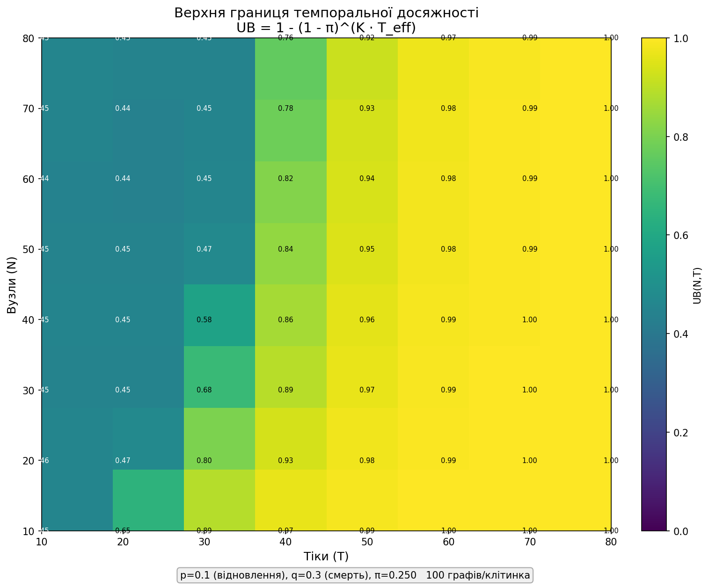
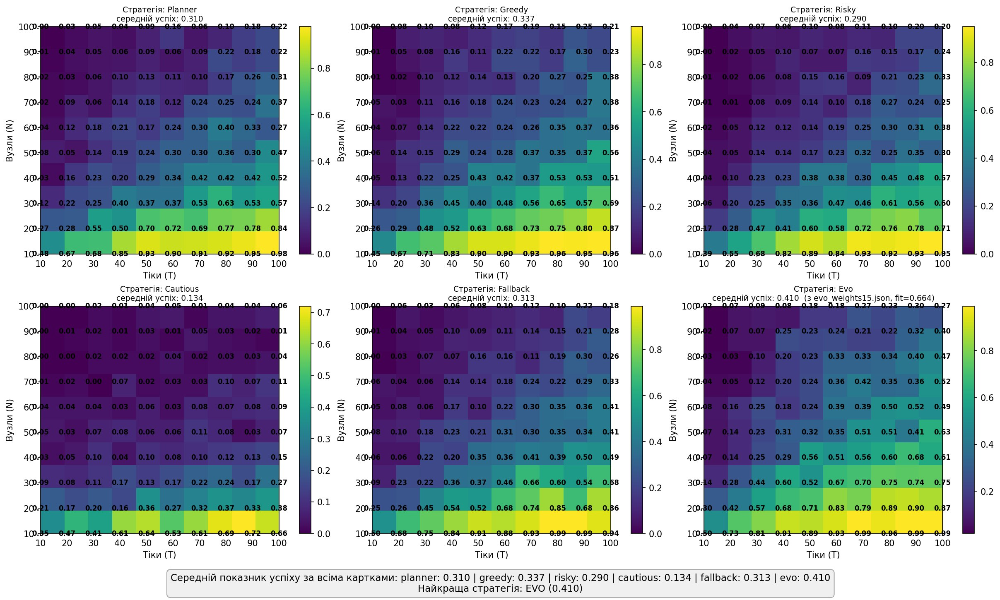

# Optimization of Multi-Agent Routing and Stability Analysis in Stochastic Dynamically Failing Network Topologies

## Abstract

This paper investigates path-finding stability, topological adaptability, and navigation efficiency of multi-agent routing strategies in highly dynamic networks governed by probabilistic edge failure and recovery processes. The environment dynamics are formalized as a discrete Markov process inducing fluctuations in the algebraic connectivity of the graph. An analytical comparison is conducted among global replanning, risk-aware, locally reactive decision-making, and a neural network agent — through the lens of spectral graph theory. Agent movement is modeled as a centralized dynamic routing process with locally constrained execution and bounded memory of recent decisions. Empirical results confirm the theoretical stability limits of global routes and the systematic advantage of locally reactive and learned heuristics in connectivity degradation zones. Strategy performance is evaluated via the **Goal Reachability Rate (GRR)** metric across the full phase space $(N, T)$. An analytically derived upper bound on GRR is obtained based on minimum cut arguments and the stationary distribution, providing an empirically motivated ceiling for comparing all agent strategies.

---

## 1. Mathematical Framework

### 1.1. Markov Edge Degradation Model

The network topology is modeled as a discrete stochastic process over a dynamic graph $G_t = (V, E_t)$, where $V$ is the static vertex set ($|V| = N$) and $E_t \subseteq V \times V$ is the random set of active edges at step $t \in \{0, 1, \dots, T\}$. The operational state of each edge $e = (u,v)$ is represented by an indicator variable $\xi_t(e) \in \{0,1\}$, governed by a homogeneous Markov chain with transition matrix $P$:

$$P = \begin{pmatrix} 1 - p_{\text{rec}} & p_{\text{rec}} \\ p_{\text{fail}} & 1 - p_{\text{fail}} \end{pmatrix} = \begin{pmatrix} 0.9 & 0.1 \\ 0.3 & 0.7 \end{pmatrix}$$

Stationary edge survival probability:

$$\pi = \frac{p_{\text{rec}}}{p_{\text{fail}} + p_{\text{rec}}} = \frac{0.1}{0.4} = 0.25$$

### 1.2. Spectral Analysis and Topological Bounds

The graph Laplacian $L_t = D_t - A_t$ is computed at each step $t$.

**Algebraic connectivity** $\lambda_2(L_t)$ (Fiedler value) serves as the fundamental metric of global connectivity. When $\lambda_2(L_t) = 0$, the graph decomposes into isolated components. At $p_{\text{fail}} = 0.3$, the network operates in chronic connectivity degradation.

**Gershgorin spectral bound:** vertex degree constraints $\forall v \in V,\ 2 \le \deg_0(v) \le 6$ imply:

$$\lambda_N(L_t) \le 2 \cdot \max_{v \in V} \deg(v) = 12$$

This excludes high-connectivity hub nodes, making the topology uniformly vulnerable to cascading Markov edge failures.

### 1.3. Upper Bound on Temporal Reachability

Let $G = (V, E)$ be the initial static graph, $A, B \in V$ the source and sink, $K = \kappa(A,B)$ the exact $s$-$t$ minimum edge cut computed by Dinic's algorithm, $L = d_G(A,B)$ the shortest path distance, and $\pi$ the stationary edge survival probability. Define the effective horizon:

$$T_{\text{eff}} = \max\!\left(1,\ T \cdot \frac{p_{\text{fail}} + p_{\text{rec}}}{2} - L + 1\right)$$

The empirically motivated GRR upper bound is:

$$\boxed{\mathrm{UB}(N, T) = 1 - (1 - \pi)^{K \cdot T_{\text{eff}}}}$$

> **Note:** This is an empirically motivated estimate, not a strict theorem. $T_{\text{eff}}$ is a heuristic correction for Markov mixing time and minimum distance $L$, and the bound assumes independence of parallel path survival windows — an assumption violated under strong Markov correlations between adjacent edges. The bound is empirically conservative across all tested configurations, making it a useful calibration tool but not a worst-case guarantee.

**Interpretation:** The minimum cut $K$ determines the number of edge-disjoint paths between $A$ and $B$. The quantity $(1-\pi)^{K \cdot T_{\text{eff}}}$ approximates the probability that no viable path window ever opens; its complement gives the GRR ceiling.

Computed by [`upper_bound.py`](upper_bound.py) using exact Dinic cuts averaged over 100 random graph instances per $(N, T)$ cell.

The heatmap confirms that the theoretical ceiling drops sharply in the small-$T$ / large-$N$ sector — precisely where all empirical strategies converge to zero GRR — providing structural validation of the observed performance collapse.

---

## 2. Agent Routing Strategies and Stability Analysis

The navigation task is formalized as a centralized dynamic routing process with locally constrained execution. Agent state at step $t$: $S_t = \langle X_t, H_t, B \rangle$, where $X_t \in V$ is the current position, $B \in V$ is the static target node, and $H_t$ is a bounded tabu memory (size 5) for suppressing immediate cyclic loops.

> **Key methodological assumption:** Although per-step policies execute locally (constrained to the 1-hop neighborhood $\mathcal{N}_t(X_t)$), all heuristics rely on global topology awareness via a centralized distance field $d_{G_t}(v, B)$ recomputed every frame. Unreachable nodes return $d_{G_t}(v, B) = \infty$ (approximated as $10^9$).

### 2.1. Greedy

$$X_{t+1} = \arg\min_{v \in \mathcal{N}_t(X_t) \setminus H_t} d_{G_t}(v, B)$$

Random step on empty feasible set. Locally reactive movement adapts faster than global topology reconfiguration, yielding the highest high-efficiency coverage among handcrafted strategies.

### 2.2. Planner

Recomputes an exact BFS shortest path every step. Under the independence approximation, the probability that a path of length $L$ remains fully active is:

$$P_{\text{stable}}(L) \approx (1 - p_{\text{fail}})^{L}$$

As $N$ grows, average path length $L$ increases and this exponential decay dominates: continuous replanning fails to compensate for instability, causing systematic timeouts at $N \ge 40$.

### 2.3. Fallback

$$X_{t+1} = \arg\min_{\substack{v \in \mathcal{N}_t(X_t) \setminus H_t \\ d_{G_t}(v,B) < \infty}} d_{G_t}(v, B)$$

Filters globally disconnected neighbors before greedy selection; takes a random step when no feasible neighbors exist. Acts as a stochastic bridge-recovery probe, but geometric waiting delay limits scalability on large graphs.

### 2.4. Cautious

Edge risk tracked via EWMA initialized at $p_{\text{fail}}$:

$$R_t(u,v) = 0.9 \cdot R_{t-1}(u,v) + 0.1 \cdot \mathbb{I}\!\left[(u,v) \notin E^{\text{active}}_t\right]$$

Movement restricted to edges with $R_t(X_t, v) < 0.35$. Aggressive filtering drives the accessible subgraph toward $\lambda_2 \to 0$, trapping the agent in persistent fragmentation and causing systematic timeouts across nearly all non-trivial configurations.

### 2.5. Risky

$\varepsilon$-greedy rule with $\varepsilon = 0.2$: random neighbor with probability 0.2, greedy step otherwise. Tabu history ignored; movement is memoryless. Random exploration occasionally escapes local traps but generates high variance in goal arrival time.

### 2.6. EVO (Neural Network Agent)

A compact feedforward neural network (architecture $8 \to 4 \to 1$) with weights optimized by a specialized evolutionary algorithm. At each step the network scores all candidate transitions (including waiting in place) and selects an action via softmin sampling with temperature $\tau = 0.15$:

$$\Pr[\text{move to } v] \propto \exp\!\left(-\frac{s(v) - \min_u s(u)}{\tau}\right)$$

where $s(v) = \mathbf{W}_2 \cdot \tanh(\mathbf{W}_1 \mathbf{f}(v) + \mathbf{b}_1) + b_2$.

**Feature vector** $\mathbf{f}(v) \in \mathbb{R}^8$:

| Index | Feature | Description |
|-------|---------|-------------|
| $f_0$ | `dist_norm` | $d_{G_t}(v,B) / d_{\max}$, or $1.5$ if unreachable |
| $f_1$ | `edge_risk` | EWMA risk of edge $(X_t, v)$; $0$ when waiting |
| $f_2$ | `visit_penalty` | $\ln(1 + \text{visits}(v)) / 3$ |
| $f_3$ | `degree_norm` | $\deg_{G_t}(v) / 6$ |
| $f_4$ | `progress` | $(d_{G_t}(X_t,B) - d_{G_t}(v,B)) / d_{\max}$ |
| $f_5$ | `reachable` | $1$ if $v$ can reach $B$, else $0$ |
| $f_6$ | `edge_survival` | $\deg_{G_t}(v) / \deg_0(v)$ |
| $f_7$ | `is_wait` | $1$ if $v = X_t$, else $0$ |

Weight vector dimensionality: $\dim(\mathbf{w}) = 8 \times 4 + 4 + 4 + 1 = 41$.

**Evolutionary training** ([`evo_train.py`](evo_train.py)):
- Population size: 60 individuals
- Selection: top-50% elitism + Hall of Fame (up to 5 historical best, selected by weight norm as diversity proxy)
- Variation: uniform crossover + Gaussian mutation ($\sigma$ adapts on stagnation: $0.4 \to 2.0$)
- Diversity: crowding penalty in weight space ($\sigma_{\text{div}} = 1.0$)
- Immigration: $\lfloor\text{pop}/8\rfloor$ random individuals injected each generation
- Stagnation reset: after 50 generations without improvement, best weights are saved and a full cold restart is launched — new file (`evo_weights{N+1}.json`), random population, cleared history; the comparison script automatically selects the file with the highest recorded fitness

Training configuration: $N = 40$, $T = 40$; 15 random graph instances per generation, 25 evaluation simulations per individual. Weights continuously saved to `evo_weights*.json`.

The search space contains $\sim 10^{82}$ weight combinations, making exhaustive search impossible. Current best weights ([`evo_weights15.json`](evo_weights15.json)) achieve **fitness = 0.664** on the training configuration $(N=40, T=40)$; mean GRR across the full grid is $0.410$, reflecting expected generalization drop outside the training domain.

---

## 3. Experimental Methodology

Simulations conducted over the full phase space grid:

| Parameter | Range | Step |
|-----------|-------|------|
| Node count $N$ | $10 \to 100$ | $\Delta N = 10$ |
| Step budget $T$ | $10 \to 100$ | $\Delta T = 10$ |
| Rounds per cell | 100 | — |
| $p_{\text{fail}}$ | $0.3$ | — |
| $p_{\text{rec}}$ | $0.1$ | — |

The upper bound ([`upper_bound.py`](upper_bound.py)) was computed on $N \in [10,80]$, $T \in [10,80]$ with 100 graphs per cell.

The distance field from sink $B$ is computed once per frame via BFS. All strategies access routing metrics via $O(1)$ array lookup, yielding a **3.8× speedup** over per-strategy BFS.

---

## 4. Results

**Mean GRR across all $(N, T)$ cells:**

| Strategy | Mean GRR |
|----------|----------|
| **EVO** | **0.410** |
| Greedy | 0.337 |
| Fallback | 0.313 |
| Planner | 0.310 |
| Risky | 0.290 |
| Cautious | 0.134 |

- **EVO** achieves the highest mean GRR, with the advantage most pronounced in the medium-difficulty corridor ($N = 40$–$70$, $T = 40$–$80$).
- **Greedy** provides the best high-efficiency coverage among handcrafted strategies, maintaining stable reachability up to $N = 40$.
- **Planner** peaks only at $N \le 20$; route instability drives GRR to zero at $N \ge 40$ regardless of $T$.
- **Cautious** collapses (mean GRR = 0.134) due to persistent fragmentation in the risk-filtered subgraph.
- **Risky** mirrors Greedy on small graphs but shows higher variance at medium scales.
- **Fallback** occupies the median position; effective on small networks, limited on large ones by bridge-recovery delay.

The upper bound heatmap confirms the small-$T$ / large-$N$ corner is structurally inaccessible to any strategy. In regions where $\mathrm{UB}(N,T) \approx 1$, the EVO gap to the ceiling identifies a reserve addressable by continued evolutionary search.

---

## 5. Conclusions

1. **Dominance of local adaptivity.** Simple locally reactive strategies fully dominate long-horizon global planning. Maintaining an accurate global trajectory is mathematically counterproductive: paths degrade faster than agents traverse them.

2. **Safety paradox.** Risk-aware routing inadvertently drives the accessible subgraph into persistent fragmentation. Local risk exposure yields higher survival rates than movement stagnation.

3. **Learned routing outperforms handcrafted heuristics.** EVO — despite its compact 41-parameter representation — consistently outperforms all handcrafted strategies by jointly learning to balance goal progress, risk awareness, revisit penalties, and the wait action. The softmin rule with $\tau = 0.15$ provides calibrated stochasticity that avoids both greedy traps and destructive randomness.

4. **Structural ceiling and improvement reserve.** Current EVO performance ($\mathrm{GRR}_{\text{mean}} = 0.410$, fitness $= 0.664$ at $N=40, T=40$) falls substantially below the empirical ceiling over most of the phase space. Continued evolutionary pressure, curriculum training over $(N, T)$, or architecture scaling are concrete paths toward closing this gap.

5. **Effectiveness of stochastic fallback.** Single-step stochastic injection under topological isolation effectively breaks infinite local routing loops but is limited in scalability by the geometric recovery delay of Markov bridge edges.

---

## 6. Limitations

- **Centralized distance oracle.** Agents receive instantaneous distance fields at zero cost; real decentralized infrastructure incurs significant update overhead.
- **Independent edge transitions.** Failures and recoveries are fully independent; real networks exhibit correlated and cascading failures.
- **Zero congestion effects.** Agent movement consumes no bandwidth; routing bottlenecks under simultaneous optimal next-hop selection are not modeled.
- **Uniform Markov parameters.** $p_{\text{fail}}$ and $p_{\text{rec}}$ are uniform constants, ignoring connection age, edge centrality, or physical load.
- **Static node set.** Only link degradation ($E_t$) is modeled; vertices are perfectly reliable.
- **Heuristic $T_{\text{eff}}$ and independence assumption.** The upper bound (§1.3) relies on a heuristic horizon correction and path independence assumption; it is empirically conservative but not a strict worst-case guarantee.

---

## 7. Codebase

| File | Description |
|------|-------------|
| [`strategies_comparison.py`](strategies_comparison.py) | Full benchmark. Evaluates all six strategies simultaneously on identical graph instances across the full $(N, T)$ phase space. Saves [`strategies_comparison.png`](strategies_comparison.png). |
| [`evo_train.py`](evo_train.py) | Evolutionary training pipeline. Supports continuous multi-run training with automatic file rotation, Hall of Fame, cold restart on stagnation, and parallel fitness evaluation. |
| [`upper_bound.py`](upper_bound.py) | Upper bound calculator. Computes $\mathrm{UB}(N,T) = 1-(1-\pi)^{K \cdot T_{\text{eff}}}$ via exact Dinic cuts averaged over 100 random graphs per cell. Saves [`upper_bound_heatmap.png`](upper_bound_heatmap.png). |
| [`evo_weights15.json`](evo_weights15.json) | Best evolutionary checkpoint. Contains the 41-dimensional weight vector (fitness = 0.664 at $N=40, T=40$), full evolution history, and population state for resuming search. |
